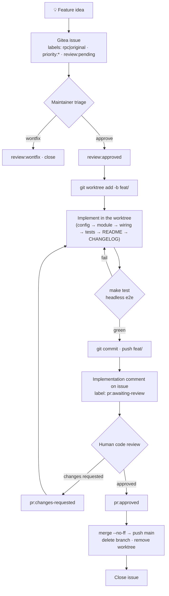

# Developing & testing pi.nvim

Operational playbook for taking a feature from idea to merged code. `AGENTS.md` is the architecture charter; this skill is authoritative for **workflow and testing**.

## Feature lifecycle



### Phase rules

| Phase | Key rules |
|-------|-----------|
| Issue | Body is the spec — never overwrite it. Implementation notes go in **comments**. Labels: type (`rpc`/`original`), priority, review gate. |
| Branch | Create a **git worktree** on `feat/<short-kebab-name>` and develop there — never in the live `lazy/pi2.nvim` checkout (see **Worktree workflow**). Baseline `make test` green before starting. |
| Implement | Follow the **standard places** checklist below. Config knobs touch **three** spots in `config.lua` (G19). |
| Test | Cheapest layer that can observe the behavior. State what was verified and what was not. |
| PR | Push branch → implementation comment → `pr:awaiting-review`. |
| Review | `pr:changes-requested` → fix → re-push → back to `pr:awaiting-review`. `pr:approved` → merge. |
| Merge | In the **main checkout**: `git merge --no-ff`, push main, delete remote+local branch, `git worktree remove`, close issue. |

Gitea API: `https://git.yuez.me/api/v1/repos/yuez/pi.nvim`, auth via `GITEA_TOKEN` (chezmoi-encrypted in `~/.zshrc.local`).

## Worktree workflow

Develop every feature in its own **git worktree**, not in the main checkout.

**Why.** The main checkout at `~/.local/share/nvim/lazy/pi2.nvim` is a *live lazy.nvim plugin path* — the running Neovim loads its code, and it must stay on `main`. Creating/switching branches there yanks the rug out from under the running editor and from any other session touching the same directory (branch switches racing with your edits, uncommitted work stranded on the wrong branch). A worktree gives your feature an isolated directory and branch while the main checkout stays put on `main`.

**Setup** (from anywhere; `MAIN` stays on `main`):

```bash
MAIN=~/.local/share/nvim/lazy/pi2.nvim            # live plugin path — leave it on main
WT_ROOT=~/.local/share/pi.nvim-worktrees           # MUST be outside .../nvim/lazy (see below)
name=grep-quickfix                                 # short kebab name

git -C "$MAIN" fetch origin
git -C "$MAIN" worktree add "$WT_ROOT/$name" -b "feat/$name" origin/main
cd "$WT_ROOT/$name"
make test                                          # baseline, must be green
```

- Keep worktrees **outside** `~/.local/share/nvim/lazy/`. lazy.nvim treats every directory under `lazy/` as a plugin, so a worktree there would be loaded as a *second* pi plugin.
- Base the branch on `origin/main` so you start from the released state.

**Verification in the worktree.** Path resolution differs by layer:

| Layer | In a worktree it exercises… |
|-------|------------------------------|
| `make test` (unit) | **the worktree** ✓ — `tests/minimal_init.lua` resolves the repo root from its own file path |
| Headless e2e with `-u tests/minimal_init.lua` | **the worktree** ✓ — same path-relative resolution |
| `make smoke` / GUI automation | **the MAIN checkout** ⚠ — these boot `~/.config/nvim/init.lua`, and lazy loads pi from its installed path, not your worktree (G23) |

So do feature verification with `make test` plus headless e2e scripts run under `-u tests/minimal_init.lua`. For smoke/GUI proof of the worktree code, either run it after merging to `main`, or temporarily point lazy at the worktree (G23 has the recipe).

**Cleanup** — only after the human review is approved and the branch is merged:

```bash
cd "$MAIN"
git merge --no-ff "feat/$name" && git push origin main
git worktree remove "$WT_ROOT/$name"     # refuses if dirty; use --force only once you've confirmed it's merged
git branch -d "feat/$name"
git push origin --delete "feat/$name"
git worktree prune                       # tidy metadata if a worktree dir was deleted by hand
git -C "$MAIN" status                   # confirm main checkout is clean and still on main
```

Do **not** remove the worktree while the PR is still under review — review rounds (`pr:changes-requested` → fix → re-push) happen inside it.

## Verification layers

| Layer | Command | Sees | Cannot see |
|-------|---------|------|------------|
| Unit (plenary) | `make test` | pure-Lua logic, config resolution | buffers, windows, keys, rendering |
| Headless e2e | `make smoke` / `nvim --headless -l script.lua` | plugin load, RPC, buffer/extmark wiring | visual rendering, real key events |
| GUI automation | `scripts/gui_launch.sh` + `gui_harness.sh` | real keybindings, insert mode, **pixels** | — (top layer, slow) |

Details, pitfalls, isolation recipe, and script usage: `references/testing.md`.

## Standard places a new feature lands

- **Config knob** → `lua/pi/config.lua` — three spots: `---@class` annotation, `pi.Options` field, `defaults` table (G19).
- **Pure logic** → `lua/pi/<name>.lua`, one table returned, `_` prefix for private, `_reset()` for testability.
- **Public API** → `lua/pi/init.lua`, nil-guard on `Sessions.get()`.
- **Chat wiring** → `lua/pi/ui/chat/init.lua`: keymaps in `_set_keymaps()`, submit logic in `_send_message()`.
- **History rendering** → `lua/pi/ui/chat/history.lua`; tool renderers → `lua/pi/ui/chat/tools.lua`.
- **Highlight group** → `lua/pi/ui/highlights.lua` (`default = true`).
- **README + CHANGELOG** → in the same commit for user-facing changes.
- **Tests** → `tests/<name>_spec.lua`; e2e per `references/testing.md`.

## Gotchas

One-line quick reference below; full 现象/根因/修法 in `references/gotchas.md`.

| # | Fix in one line |
|---|-----------------|
| G1 | Defer buffer edits in `<expr>` mappings with `vim.schedule` |
| G2 | Return literal `"<Up>"` from `<expr>`, never `vim.keycode` |
| G3 | Compare buffer text to last-applied, don't use a timing flag |
| G4 | Headless: call save method directly, `TextChanged` won't fire |
| G5 | Headless: feed `"i<Up>"` in one call, or bind `{ "i", "n" }` |
| G6 | Visual correctness needs a GUI screenshot, headless can't prove it |
| G7 | Builtin renderer is `conceallevel=0`; use render-markdown for chrome |
| G8 | render-markdown auto-attach needs `plugin/` sourced (lazy does this) |
| G9 | Headless: force `render-markdown.render({ buf = buf })` |
| G10 | markview ignores `buftype=nofile`; prefer render-markdown |
| G11 | Enter history window from prompt to avoid WinEnter redirect |
| G12 | Send `Esc` before normal/leader keys (prompt auto-inserts) |
| G13 | lazy loads on first key; `wait_for` the buffer |
| G14 | `before_each`/`after_each` must be inside a `describe` |
| G15 | Use `NVIM_BIN` not `NVIM` in Makefile |
| G16 | Put cleanup in script files, not inline `bash -c` |
| G17 | Redirect history/draft paths to `/tmp` in tests |
| G18 | Never delete sessions by grep; stubbed send writes no transcript |
| G19 | Edit all three config spots together |
| G20 | Read `config.options` at call time, never cache at module load |
| G21 | Restart nvim after editing `lua/pi/**`; lazy never hot-reloads |
| G22 | No whole-buffer APIs (`nvim_win_text_height`, full `get_lines`) on per-event paths; gate behind a cheap provability check |
| G23 | In a worktree, `make smoke`/GUI load the MAIN checkout (lazy path), not your code; verify with `make test` + `-u tests/minimal_init.lua` |

## Cross-references

- `references/architecture.md` — module map, hard design constraints, rationale for standard places.
- `references/testing.md` — layer details, pitfalls, isolation recipe, verification discipline, script usage.
- `references/gotchas.md` — full 现象/根因/修法 for G1–G23 with minimal reproductions.
- `AGENTS.md` — architecture charter, style, type-annotation conventions.
- `.agents/skills/commit/SKILL.md` — Conventional Commit format, CHANGELOG rules, breaking-change policy.
