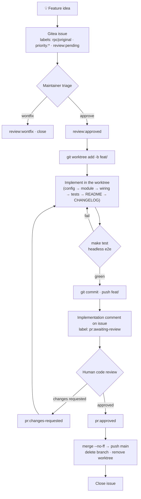

# Developing & testing pi.nvim

Operational playbook for taking a feature from idea to merged code. `AGENTS.md` is the architecture charter; this skill is authoritative for **workflow and testing**. Depth lives in `references/` — this file is the index.

## Feature lifecycle



### Phase rules

| Phase | Key rules |
|-------|-----------|
| Issue | Body is the spec — never overwrite it. Implementation notes go in **comments**. Labels: type (`rpc`/`original`), priority, review gate. |
| Branch | Create a **git worktree** on `feat/<short-kebab-name>` and develop there — never in the live `lazy/pi2.nvim` checkout. Baseline `make test` green before starting. |
| Implement | Follow the **standard places** checklist below. Config knobs touch **three** spots in `config.lua` (G19). |
| Test | Cheapest layer that can observe the behavior. State what was verified and what was not. |
| PR | Push branch → implementation comment → `pr:awaiting-review`. |
| Review | `pr:changes-requested` → fix → re-push → back to `pr:awaiting-review`. `pr:approved` → merge. |
| Merge | In the **main checkout**: `git merge --no-ff`, push main, delete remote+local branch, `git worktree remove`, close issue. |

Gitea API: `https://git.yuez.me/api/v1/repos/yuez/pi.nvim`, auth via `GITEA_TOKEN` (chezmoi-encrypted in `~/.zshrc.local`).

## Worktree workflow

Develop every feature in its own **git worktree**, never in the main checkout: `~/.local/share/nvim/lazy/pi2.nvim` is a *live lazy.nvim plugin path* the running editor loads, so it must stay on `main` — branching there swaps the running editor's code and races with concurrent sessions.

```bash
MAIN=~/.local/share/nvim/lazy/pi2.nvim; WT_ROOT=~/.local/share/pi.nvim-worktrees; name=<short-kebab>
git -C "$MAIN" worktree add "$WT_ROOT/$name" -b "feat/$name" origin/main   # keep OUTSIDE .../nvim/lazy
```

In a worktree, `make test` and headless e2e under `-u tests/minimal_init.lua` exercise **the worktree**, but `make smoke`/GUI load the **main checkout** (G23). Remove the worktree only after review is approved and merged. Full setup/verification/cleanup commands: `references/worktree.md`.

## Verification layers

| Layer | Command | Sees | Cannot see |
|-------|---------|------|------------|
| Unit (plenary) | `make test` | pure-Lua logic, config resolution | buffers, windows, keys, rendering |
| Headless e2e | `make smoke` / `nvim --headless -l script.lua` | plugin load, RPC, buffer/extmark wiring | visual rendering, real key events |
| GUI automation | `scripts/gui_launch.sh` + `gui_harness.sh` | real keybindings, insert mode, **pixels** | — (top layer, slow) |

Details, pitfalls, isolation recipe, and script usage: `references/testing.md`.

## Standard places a new feature lands

- **Config knob** → `lua/pi/config.lua` — three spots: `---@class` annotation, `pi.Options` field, `defaults` table (G19).
- **Pure logic** → `lua/pi/<name>.lua`, one table returned, `_` prefix for private, `_reset()` for testability.
- **Public API** → `lua/pi/init.lua`, nil-guard on `Sessions.get()`.
- **Chat wiring** → `lua/pi/ui/chat/init.lua`: keymaps in `_set_keymaps()`, submit logic in `_send_message()`.
- **History rendering** → `lua/pi/ui/chat/history.lua`; tool renderers → `lua/pi/ui/chat/tools.lua`.
- **Highlight group** → `lua/pi/ui/highlights.lua` (`default = true`).
- **README + CHANGELOG** → in the same commit for user-facing changes.
- **Tests** → `tests/<name>_spec.lua`; e2e per `references/testing.md`.

## Gotchas

G1–G26 are indexed in the quick-reference table at the top of `references/gotchas.md`, with full 现象/根因/修法 and minimal reproductions below it. Read the full entry before relying on a one-liner. Most frequent traps: G1/G2/G3 (expr-mapping keys), G4/G5 (headless e2e), G6 (visual needs a GUI screenshot), G14 (spec scoping), G19 (three config spots), G21 (restart nvim after editing `lua/pi/**`), G23 (worktree test layers), G24 (LuaJIT-parseable syntax).

## Cross-references

- `references/worktree.md` — why worktrees, exact setup/verification/cleanup commands, layer caveats.
- `references/architecture.md` — module map, hard design constraints, rationale for standard places.
- `references/testing.md` — layer details, pitfalls, isolation recipe, verification discipline, script usage.
- `references/gotchas.md` — quick-reference table + full 现象/根因/修法 for G1–G24 with minimal reproductions.
- `AGENTS.md` — architecture charter, style, type-annotation conventions.
- `.agents/skills/commit/SKILL.md` — Conventional Commit format, CHANGELOG rules, breaking-change policy.
