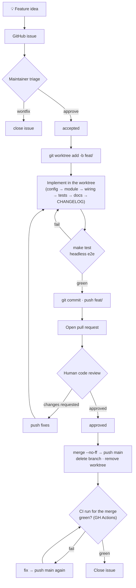

# Developing & testing Agent Workbench

Operational playbook for taking a feature from idea to merged code. `AGENTS.md` is the architecture charter; this skill is authoritative for **workflow and testing**. Depth lives in `references/` — this file is the index.

## Feature lifecycle



### Phase rules

| Phase | Key rules |
| ------- | ----------- |
| Issue | Body is the spec — never overwrite it. Implementation notes go in comments or the linked pull request. |
| Branch | Create a **git worktree** on `feat/<short-kebab-name>` and develop there — never in the live `lazy/agent-workbench.nvim` checkout. Baseline `make test` green before starting. |
| Implement | Follow the **standard places** checklist below. Config knobs touch **three** spots in `config.lua` (G19). |
| Test | Cheapest layer that can observe the behavior. State what was verified and what was not, and end the final report's verification section with a copy-pasteable manual-test nvim command (`PI_DEV_DIR` gate for worktree code — references/testing.md § Verification discipline). |
| PR | Push branch → open a pull request linked to the issue. CI runs on the push; confirm the run is green before review. |
| Review | Address requested changes on the same branch, push, and return to review. |
| Merge | In the **main checkout**: `git merge --no-ff`, push main, delete remote+local branch, `git worktree remove`. **Verify the CI run for the merge commit is green** (see CI verification below), then close issue. |

GitHub: use `gh` for issues, pull requests, Actions, and releases. Repository lifecycle commands live in `references/github.md`.

## Worktree workflow

Develop every feature in its own **git worktree**, never in the main checkout: `~/.local/share/nvim/lazy/agent-workbench.nvim` is a *live lazy.nvim plugin path* the running editor loads, so it must stay on `main` — branching there swaps the running editor's code and races with concurrent sessions.

```bash
MAIN=~/.local/share/nvim/lazy/agent-workbench.nvim; WT_ROOT=~/.local/share/agent-workbench.nvim-worktrees; name=<short-kebab>
git -C "$MAIN" worktree add "$WT_ROOT/$name" -b "feat/$name" origin/main   # keep OUTSIDE .../nvim/lazy
```

In a worktree, `make test`, `make smoke`, and headless e2e under `-u tests/minimal_init.lua` exercise **the worktree**. GUI automation still loads the installed main checkout unless explicitly redirected (G23). Remove the worktree only after review is approved and merged. Full setup/verification/cleanup commands: `references/worktree.md`.

## Verification layers

| Layer | Command | Sees | Cannot see |
| ------- | --------- | ------ | ------------ |
| Unit (plenary) | `make test` | pure-Lua logic, config resolution | buffers, windows, keys, rendering |
| Headless e2e | `make smoke` / `nvim --headless -l script.lua` | plugin load, RPC, buffer/extmark wiring | visual rendering, real key events |
| GUI automation | `scripts/gui_launch.sh` + `gui_harness.sh` (macOS: `scripts/macos/`) | real keybindings, insert mode, **pixels** | — (top layer, slow) |
| CI gate | `.github/workflows/lint.yml` (auto on push/PR) | `make style` + `make lint` reproducibility on a clean runner | plugin runtime; mirrors style/lint only, not `make test` |

Details, pitfalls, isolation recipe, and script usage: `references/testing.md`.

## CI verification

A feature is **not complete until the CI run for its merge commit is green** — local green ≠ CI green (the runner is a different, clean environment). `.github/workflows/lint.yml` runs `make style` + `make lint` on every push to `main` and on PRs; it is self-contained (downloads stylua + lua-language-server, no Neovim needed). `make test` is **not** in CI yet — keep running it locally.

- The repo is public, so run status is readable without auth:
  `gh run list --repo saya-ashen/agent-workbench.nvim --branch main --limit 5`
- Inspect a run's jobs/steps: `.../actions/runs/<run_id>/jobs` (or `gh run view <run_id>`).
- The workflow has no `workflow_dispatch`; it triggers on push/PR. To trigger it, push a commit. Manual dispatch needs auth (`gh auth login` or a PAT with `actions:write`).
- On failure, fix on a branch, push, and re-check the new run before (re-)merging.

## Standard places a new feature lands

- **Config knob** → `lua/agent-workbench/config.lua` — three spots: `---@class` annotation, `agent_workbench.Options` field, `defaults` table (G19).
- **Pure logic** → `lua/agent-workbench/<name>.lua`, one table returned, `_` prefix for private, `_reset()` for testability.
- **Public API** → `lua/agent-workbench/init.lua`, nil-guard on `Sessions.get()`.
- **Chat wiring** → `lua/agent-workbench/ui/chat/init.lua`: keymaps in `_set_keymaps()`, submit logic in `_send_message()`.
- **History rendering** → `lua/agent-workbench/ui/chat/history.lua`; tool renderers → `lua/agent-workbench/ui/chat/tools.lua`.
- **Highlight group** → `lua/agent-workbench/ui/highlights.lua` (`default = true`).
- **Docs (README + `doc/`) + CHANGELOG** → docs-code consistency is mandatory: user-facing changes update `README.md` / the relevant `doc/*.md` in the same commit; internal changes still verify the docs remain accurate and fix any drift. Run `make docs-links` before committing.
- **Tests** → `tests/<name>_spec.lua`; e2e per `references/testing.md`.

## Gotchas

G1–G30 are indexed in the quick-reference table at the top of `references/gotchas.md`, with full 现象/根因/修法 and minimal reproductions below it. Read the full entry before relying on a one-liner. Most frequent traps: G1/G2/G3 (expr-mapping keys), G4/G5 (headless e2e), G6 (visual needs a GUI screenshot), G14 (spec scoping), G19 (three config spots), G21 (restart nvim after editing `lua/agent-workbench/**`), G23 (worktree test layers), G24 (LuaJIT-parseable syntax).

## Cross-references

- `references/worktree.md` — why worktrees, exact setup/verification/cleanup commands, layer caveats.
- `references/architecture.md` — module map, hard design constraints, rationale for standard places.
- `references/testing.md` — layer details, pitfalls, isolation recipe, verification discipline, script usage.
- `references/gotchas.md` — quick-reference table + full 现象/根因/修法 for G1–G30 with minimal reproductions.
- `references/github.md` — `gh` CLI cheat sheet for issues, pull requests, and Actions.
- `AGENTS.md` — architecture charter, style, type-annotation conventions.
- `.agents/skills/commit/SKILL.md` — Conventional Commit format, CHANGELOG rules, breaking-change policy.
