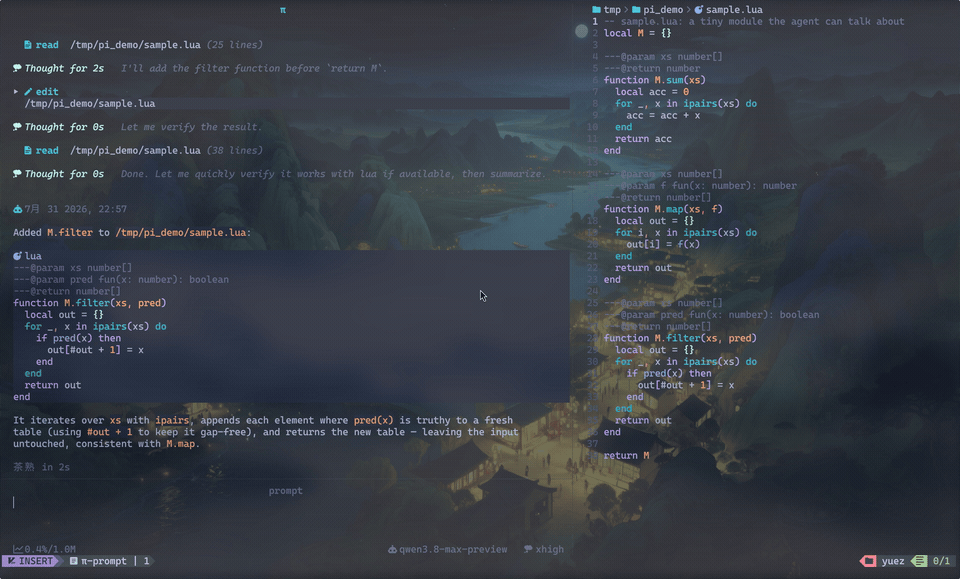

# Agent Workbench

> A workspace-aware Neovim workbench for coding agents, currently powered by [pi.dev](https://pi.dev).
>
> Built from [`pi.nvim`](https://github.com/alex35mil/pi.nvim)'s foundation, independently maintained around multi-workspace sessions, reviewed edits, and an in-editor command workflow.

[](https://opensource.org/licenses/MIT)
[](https://neovim.io)
[](https://pi.dev)

Agent Workbench runs `pi --mode rpc` beside Neovim and turns agent work into an editor-native workflow. Conversations, files, workspace state, tool output, shell commands, diffs, and attention requests stay inside Neovim without replacing normal editing.

The editor layer is designed to support additional coding-agent backends over time. Current releases support pi.dev only.

The Lua namespace remains `pi` for compatibility:

```lua
require("pi").setup()
```

The project name is separate from the Lua namespace. This repository is not an official new version of `pi.nvim`.



## Why It Exists

Most agent integrations treat one Neovim process, one project, and one chat as one global context. That breaks down when work spans several projects, tabs, sessions, or editor windows.

This frontend treats agent work as stateful editor work:

- each tab can own one project workspace;
- each session owns its own transcript, prompt, attachments, model state, and RPC process;
- hidden sessions keep running without taking over the visible chat;
- agent edits remain reviewable before they reach files;
- local shell work stays available without entering model context;
- normal Neovim buffers and navigation remain first-class.

## Core Features

### Workspaces Without Context Mixing

Each tab acts as an independent workspace with its own working directory, buffers, sessions, and agent process.

- `:PiNewWorkspace` creates a workspace rooted at a selected directory.
- `:PiWorkspaces` switches workspaces through a searchable picker.
- `:PiWorkspaceSidebar` shows workspaces, sessions, and ordinary buffers together.
- `:PiMoveBuffer` moves ordinary buffers between workspaces.
- Workspace buffers stay scoped to the current tab instead of leaking across projects.
- Changing workspace cwd starts a fresh session only when the current session is idle.
- Workspace state and unsent drafts are isolated by cwd and Neovim process.

### Multiple Independent Agent Sessions

Sessions are buffer-owned instead of being one global chat singleton.

- Keep several sessions alive in one tab or across tabs.
- Switch sessions with ordinary buffer commands.
- Continue or resume sessions for the current working directory.
- Background output stays in its owning History buffer.
- Re-entering a session restores its last History cursor and folds.
- `:PiSessions` gives one live overview of busy, idle, attention, and stopped sessions.
- `:PiTree` navigates conversation branches and can summarize abandoned branches.
- `:PiSessionStats` shows messages, tokens, cache usage, cost, and context usage.
- Manual and automatic context compaction keep long sessions usable.

### Agent Edits With Review Control

Agent output is useful only when its changes remain understandable and reversible.

- `:PiDiff` reviews all files changed by the current session in one panel.
- Two-way diff review supports accepting, rejecting, and editing proposed results.
- Review notes and permission-extension requests stay in the editor workflow.
- Unsaved buffers are never overwritten by automatic reload.
- Failed writes keep diff review open instead of silently closing it.
- `gf` jumps from paths, mentions, and line references in chat history.
- Search results can populate quickfix for normal `:cnext` and `:cprev` navigation.

### Prompt That Behaves Like Neovim

Prompt editing keeps normal editor habits while adding agent-specific controls.

- Readline-style prompt history with `<C-p>` and `<C-n>`.
- Unsent prompts persist across restart.
- Drafts are scoped by workspace and process, preventing cross-project prompt leaks.
- `@` mentions support files, line ranges, git state, LSP errors, quickfix entries, and custom providers.
- Slash commands and popup completion work inside the prompt.
- Queue follow-up prompts while the agent is busy.
- Double `<Esc>` aborts a running turn, including retry backoff.
- Attach images from disk, clipboard, or drag-and-drop.
- Optional image downscaling and re-encoding reduce attachment size.
- Zen mode provides a larger prompt for long instructions.
- Models and thinking levels can change during a session.

### Persistent Shell Worksheet

Submit `!!` to open a persistent Fish worksheet inside the existing Prompt buffer. Submit `!!command` to run an initial command.

The worksheet is file-style Neovim editing, not terminal-mode input:

- Fish state persists across cells, including cwd, variables, aliases, and functions.
- Commands bypass pi RPC and stay outside LLM context.
- Fish completion comes from the same persistent session.
- Completion covers commands, options, aliases, functions, variables, and paths.
- Command whitespace triggers argument and path completion immediately.
- Exact current options remain visible alongside longer Fish candidates.
- Completed command and output blocks are protected and foldable.
- Each command keeps a virtual `❯` prompt without changing stored text.
- ANSI colors, URLs, paths, unified diffs, and JSON output receive editor highlights when supported.
- Copying, searching, visual selection, `gf`, and normal motions operate on original output text.
- Normal-mode editing from historical output jumps to the current input cell.
- `<C-c>` interrupts only while a command is running; idle behavior stays native.
- `<C-d>`, `q`, and `<C-g>p` return to compose while preserving worksheet state.
- Prompt requests can temporarily replace the worksheet while Fish keeps running.

The worksheet currently requires the `fish` executable. It does not replace the user's normal shell configuration and does not make `!!` commands private: commands can still modify files and external systems.

### Native Neovim UI

The frontend uses normal Neovim buffers, windows, extmarks, folds, quickfix, and buffer navigation.

- Chat supports buffer, side, and float layouts.
- History is a listed `nofile` buffer with structured tool and thinking blocks.
- Tool output folds without losing extmarks or transcript state.
- Statusline shows agent state, elapsed time, queue count, context, token usage, cost, and abort hints.
- Attention requests queue until the user opens them.
- Extension UI can use dialogs, pickers, widgets, and custom blocks.
- Existing plugins such as `markview.nvim`, `blink.cmp`, `img-clip.nvim`, `bufferline.nvim`, and `nvim-web-devicons` integrate when installed but are not required for core session management.

## Quick Start

1. Install `pi` and make sure it is in `$PATH`.
2. Install this plugin and the default Markdown renderer.
3. Run `:checkhealth pi`.
4. Open a project and run `:Pi`.
5. Type a prompt and press `<CR>`.
6. Use `@path/to/file` to attach code context.
7. Use `:PiDiff` before accepting agent edits.
8. Use `!!` when local shell work should stay outside agent context.

## Requirements

- Neovim 0.10+
- [`pi`](https://pi.dev) in `$PATH`
- [`OXY2DEV/markview.nvim`](https://github.com/OXY2DEV/markview.nvim) for the default `render.engine = "markview"`
- `fish` for the `!!` Shell Worksheet

Optional:

- `nvim-treesitter` with the Markdown parser for richer History highlighting
- [`HakonHarnes/img-clip.nvim`](https://github.com/HakonHarnes/img-clip.nvim) for `:PiPasteImage`
- `blink.cmp` for popup prompt completion
- `bufferline.nvim` for workspace tabs
- `nvim-web-devicons` for workspace sidebar icons and path highlights

Run `:checkhealth pi` after installation.

## Installation

### lazy.nvim

```lua
{
    "saya-ashen/agent-workbench.nvim",
    dependencies = {
        "OXY2DEV/markview.nvim",
        "HakonHarnes/img-clip.nvim", -- optional: :PiPasteImage
    },
    opts = {},
}
```

### vim.pack

```lua
vim.pack.add({
    "https://github.com/saya-ashen/agent-workbench.nvim",
    "https://github.com/OXY2DEV/markview.nvim",
})

require("pi").setup()
```

Defaults are usable without a custom configuration. Full options live in [doc/configuration.md](doc/configuration.md).

## Commands

| Command | Purpose |
| --- | --- |
| `:Pi` | Open or toggle chat in the current workspace |
| `:PiContinue` | Continue the newest session for the current cwd |
| `:PiResume` | Pick a previous session for the current cwd |
| `:PiNewSession` | Create another independent session |
| `:PiStop` | Stop the current RPC process and close its session |
| `:PiToggleChat` | Hide or show chat without stopping the session |
| `:PiToggleLayout` | Switch between side and float layouts |
| `:PiSessions` | Show all live sessions and their state |
| `:PiTree` | Navigate the current session tree |
| `:PiSessionStats` | Show usage and cost statistics |
| `:PiDiff` | Review files changed by the current session |
| `:PiNewWorkspace` | Create a directory-backed workspace |
| `:PiWorkspaces` | Pick a workspace |
| `:PiWorkspaceSidebar` | Toggle the workspace explorer |
| `:PiMoveBuffer {tab}` | Move an ordinary buffer to another workspace |
| `:PiAttention` | Open the next queued attention request |
| `:PiAbort` | Abort the current agent turn |
| `:PiAbortBash` | Abort the running `!` command |
| `:PiCompact [instructions]` | Compact session context |
| `:PiCycleModel` / `:PiSelectModel` | Change model |
| `:PiCycleThinking` / `:PiSelectThinking` | Change thinking level |
| `:PiAttachImage {path}` | Attach an image file |
| `:PiPasteImage` | Attach an image from the clipboard |
| `:PiToggleAutoCompaction` | Toggle automatic compaction |
| `:PiSessionName [name]` | Set or show session name |
| `:PiToggleDebug` | Toggle RPC debug logging |

Every command has a Lua API counterpart. See [doc/api.md](doc/api.md).

## Configuration

```lua
require("pi").setup({
    auto_start_session = true,
    layout = {
        default = "buffer",
        side = { position = "right", width = 80 },
    },
    workspace_bar = {
        enabled = true,
        label = "name",
        session_count = true,
        status = true,
    },
    workspace_sidebar = {
        position = "right",
        width = 38,
    },
})
```

See [doc/configuration.md](doc/configuration.md) for all options.

## Development

Run Neovim from this checkout:

```sh
./scripts/nvim-dev
```

The repository includes Plenary unit tests and a hermetic headless boot check. `make` is used by project documentation when available; direct Neovim commands are documented in `.agents/skills/develop/` for environments without `make`.

## Documentation

- [Usage](doc/usage.md): chat, prompt, shell worksheet, completion, attachments, statusline, rendering, and navigation
- [Sessions](doc/sessions.md): workspaces, session ownership, resume, tree navigation, and compaction
- [Diff review](doc/diff-review.md): review workflow, notes, and permission extensions
- [Configuration](doc/configuration.md): complete annotated defaults and project trust
- [Keymaps](doc/keymaps.md): key specifications, stable filetypes, and setup examples
- [API](doc/api.md): public Lua API
- [Extensions](doc/extensions.md): extension UI and custom RPC blocks
- [Highlight groups](doc/highlight-groups.md): all plugin highlight groups
- [Troubleshooting](doc/troubleshooting.md): healthcheck, RPC logs, and lifecycle diagnosis

## Relationship To pi.nvim

This project started from `pi.nvim` and keeps its compatible Lua namespace and command family. It is independently maintained and focuses on editor-native workspaces, multiple live sessions, reviewed agent edits, and persistent local shell workflows.

It is not an official successor or replacement for `pi.nvim`. Upstream changes are reviewed selectively rather than merged blindly. Credit for the original foundation remains with the upstream project and its authors.

## License

[MIT](LICENSE)
