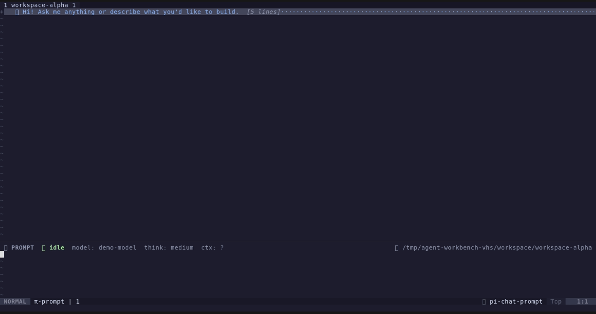
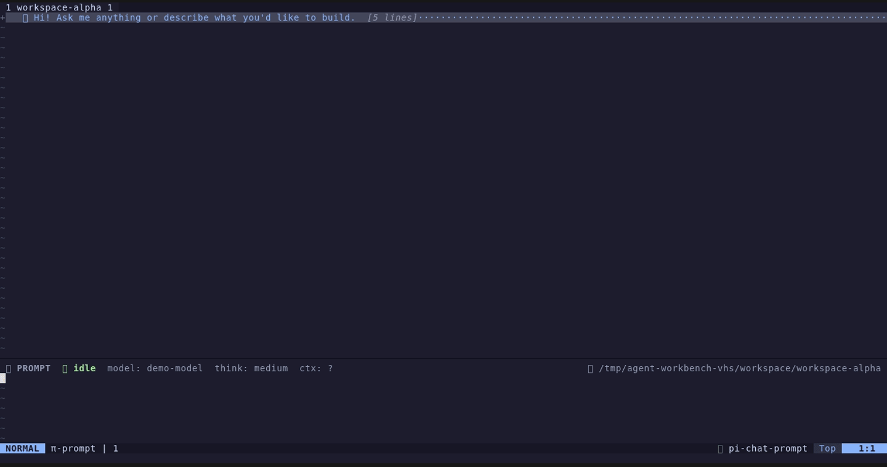

# Agent Workbench

> A workspace-aware Neovim workbench for coding agents, currently powered by [pi.dev](https://pi.dev).
>
> Built from [`pi.nvim`](https://github.com/alex35mil/pi.nvim)'s foundation, independently maintained around multi-workspace sessions, reviewed edits, and an in-editor command workflow.

[](https://opensource.org/licenses/MIT)
[](https://neovim.io)
[](https://pi.dev)

Agent Workbench runs `pi --mode rpc` beside Neovim and turns agent work into an editor-native workflow. Conversations, files, workspace state, tool output, shell commands, diffs, and attention requests stay inside Neovim without replacing normal editing.

The editor layer is designed to support additional coding-agent backends over time. Current releases support pi.dev only.

The canonical Lua namespace is now `agent-workbench`:

```lua
require("agent-workbench").setup()
```

Legacy `require("pi")` remains as a deprecated compatibility entry until `2.0.0`. New configuration should use the canonical namespace. This repository is not an official new version of `pi.nvim`.

## Why It Exists

Most agent integrations treat one Neovim process, one project, and one chat as one global context. That breaks down when work spans several projects, tabs, sessions, or editor windows.

This frontend treats agent work as stateful editor work:

- each tab can own one project workspace;
- each session owns its own transcript, prompt, attachments, model state, and RPC process;
- hidden sessions keep running without taking over the visible chat;
- agent edits remain reviewable before they reach files;
- local shell work stays available without entering model context;
- normal Neovim buffers and navigation remain first-class.

## See It In Action

Agent Workbench keeps agent sessions, workspace state, and local shell work visible inside Neovim.

### Workspace And Session Flow

The overview recording shows buffer chat, independent sessions, background work, and workspace switching. Each workspace keeps its own session and editor view.



### Local Shell Work Without Leaving Neovim

The Shell Worksheet recording shows `!!` opening persistent Fish, state surviving across cells, and `btop` opening in a terminal float before returning to the worksheet.



## Core Features

### Workspaces Without Context Mixing

Each tab acts as an independent workspace with its own working directory, buffers, sessions, and agent process.

- `:AgentWorkbenchNewWorkspace` creates a workspace rooted at a selected directory.
- `:AgentWorkbenchWorkspaces` switches workspaces through a searchable picker.
- `:AgentWorkbenchWorkspaceSidebar` shows workspaces, sessions, and ordinary buffers together.
- Press `p` on a sidebar session row to preview live output without switching workspace or changing cwd.
- `:AgentWorkbenchMoveBuffer` moves ordinary buffers between workspaces.
- Workspace buffers stay scoped to the current tab instead of leaking across projects.
- Changing workspace cwd starts a fresh session only when the current session is idle.
- Workspace state and unsent drafts are isolated by cwd and Neovim process.

### Multiple Independent Agent Sessions

Sessions are buffer-owned instead of being one global chat singleton.

- Keep several sessions alive in one tab or across tabs.
- Switch sessions with ordinary buffer commands.
- Continue or resume sessions for the current working directory.
- Background output stays in its owning History buffer.
- Re-entering a session restores its last History cursor and folds.
- `:AgentWorkbenchSessions` gives one live overview of busy, idle, attention, and stopped sessions.
- `:AgentWorkbenchTree` navigates conversation branches and can summarize abandoned branches.
- `:AgentWorkbenchSessionStats` shows messages, tokens, cache usage, cost, and context usage.
- Manual and automatic context compaction keep long sessions usable.
- `/new` keeps the current session alive and opens another; `/replace` discards the current idle session and reuses its view.

### Agent Edits With Review Control

Agent output is useful only when its changes remain understandable and reversible.

- `:AgentWorkbenchDiff` reviews all files changed by the current session in one panel.
- Two-way diff review supports accepting, rejecting, and editing proposed results.
- Review notes and permission-extension requests stay in the editor workflow.
- Unsaved buffers are never overwritten by automatic reload.
- Failed writes keep diff review open instead of silently closing it.
- `gf` jumps from paths, mentions, and line references in chat history.
- Search results can populate quickfix for normal `:cnext` and `:cprev` navigation.

### Prompt That Behaves Like Neovim

Prompt editing keeps normal editor habits while adding agent-specific controls.

- Readline-style prompt history with `<C-p>` and `<C-n>`.
- Unsent prompts persist across restart.
- Drafts are scoped by workspace and process, preventing cross-project prompt leaks.
- `@` mentions support files, line ranges, git state, LSP errors, quickfix entries, and custom providers.
- Slash commands and popup completion work inside the prompt; `/model` completes available models and `/thinking` completes levels supported by the current model.
- Queue follow-up prompts while the agent is busy.
- Double `<Esc>` aborts a running turn, including retry backoff.
- Attach images from disk, clipboard, or drag-and-drop.
- Optional image downscaling and re-encoding reduce attachment size.
- Zen mode provides a larger prompt for long instructions.
- Models and thinking levels can change during a session.

### Persistent Shell Worksheet

Submit `!!` to open a persistent Fish worksheet inside the existing Prompt buffer. Submit `!!command` to run an initial command.

The worksheet is file-style Neovim editing, not terminal-mode input:

- Fish state persists across cells, including cwd, variables, aliases, and functions.
- Commands bypass pi RPC and stay outside LLM context.
- Fish completion comes from the same persistent session.
- Completion covers commands, options, aliases, functions, variables, and paths.
- Command whitespace triggers argument and path completion immediately.
- Exact current options remain visible alongside longer Fish candidates.
- Completed command and output blocks are protected and foldable.
- Each command keeps a virtual `❯` prompt without changing stored text.
- ANSI colors, URLs, paths, unified diffs, and JSON output receive editor highlights when supported.
- Copying, searching, visual selection, `gf`, and normal motions operate on original output text.
- Normal-mode editing from historical output jumps to the current input cell.
- While a command is running, `<CR>` sends the current input to its foreground PTY instead of starting a second cell. This supports line-oriented nested shells and REPLs such as `nix shell`.
- Commands that enter a standard alternate screen, including `btop`, `htop`, `fzf`, and `lazygit`, automatically open the same persistent PTY in a native terminal float. Leaving the alternate screen or ending the outer command restores the worksheet; terminal-mode `<C-g>c` interrupts it, terminal-mode `<C-g>p` returns early while leaving it running, and Normal-mode `q` interrupts the program and closes the float.
- `<C-c>` interrupts only while a command is running; idle behavior stays native.
- Outside the terminal float, `<C-d>`, `q`, and `<C-g>p` return to compose while preserving worksheet state.
- Prompt requests can temporarily replace the worksheet while Fish keeps running.

The worksheet currently requires the `fish` executable. It does not replace the user's normal shell configuration and does not make `!!` commands private: commands can still modify files and external systems. Foreground input stays line-oriented until a command emits a standard alternate-screen sequence; Agent Workbench then displays that same PTY in a native terminal float for full-screen input and resize handling. Programs that need raw input without entering an alternate screen are not detected. Hidden password prompts remain visible in the worksheet, so do not enter secrets there.

### Native Neovim UI

The frontend uses normal Neovim buffers, windows, extmarks, folds, quickfix, and buffer navigation.

- Chat supports buffer, side, and float layouts.
- History is a listed `nofile` buffer with structured tool and thinking blocks.
- Tool output folds without losing extmarks or transcript state.
- Statusline shows agent state, elapsed time, queue count, context, token usage, cost, and abort hints.
- Attention requests queue until the user opens them.
- Extension UI can use dialogs, pickers, widgets, and custom blocks.
- Existing plugins such as `markview.nvim`, `blink.cmp`, `img-clip.nvim`, `bufferline.nvim`, and `nvim-web-devicons` integrate when installed but are not required for core session management.

## Quick Start

1. Install `pi` and make sure it is in `$PATH`.
2. Install this plugin and the default Markdown renderer.
3. Run `:checkhealth agent-workbench`.
4. Open a project and run `:AgentWorkbench`.
5. Type a prompt and press `<CR>`.
6. Use `@path/to/file` to attach code context.
7. Use `:AgentWorkbenchDiff` before accepting agent edits.
8. Use `!!` when local shell work should stay outside agent context.

## Requirements

- Neovim 0.10+
- [`pi`](https://pi.dev) in `$PATH`
- [`OXY2DEV/markview.nvim`](https://github.com/OXY2DEV/markview.nvim) for the default `render.engine = "markview"`
- `fish` for the `!!` Shell Worksheet

Optional:

- `nvim-treesitter` with the Markdown parser for richer History highlighting
- [`HakonHarnes/img-clip.nvim`](https://github.com/HakonHarnes/img-clip.nvim) for `:AgentWorkbenchPasteImage`
- `blink.cmp` for popup prompt completion
- `bufferline.nvim` for workspace tabs
- `nvim-web-devicons` for workspace sidebar icons and path highlights

Run `:checkhealth agent-workbench` after installation.

## Installation

### lazy.nvim

```lua
{
    "saya-ashen/agent-workbench.nvim",
    dependencies = {
        "OXY2DEV/markview.nvim",
        "HakonHarnes/img-clip.nvim", -- optional: :AgentWorkbenchPasteImage
    },
    opts = {},
}
```

### vim.pack

```lua
vim.pack.add({
    "https://github.com/saya-ashen/agent-workbench.nvim",
    "https://github.com/OXY2DEV/markview.nvim",
})

require("agent-workbench").setup()
```

Defaults are usable without a custom configuration. Full options live in [doc/configuration.md](doc/configuration.md).

## Commands

| Command | Purpose |
| --- | --- |
| `:AgentWorkbench` | Open or toggle chat in the current workspace |
| `:AgentWorkbenchContinue` | Continue the newest session for the current cwd |
| `:AgentWorkbenchResume` | Pick a previous session for the current cwd |
| `:AgentWorkbenchNewSession` | Create another independent session |
| `:AgentWorkbenchReplaceSession` | Replace the current idle session |
| `:AgentWorkbenchStop` | Stop the current RPC process and close its session |
| `:AgentWorkbenchToggleChat` | Hide or show chat without stopping the session |
| `:AgentWorkbenchToggleLayout` | Switch between buffer and float layouts |
| `:AgentWorkbenchSessions` | Show all live sessions and their state |
| `:AgentWorkbenchTree` | Navigate the current session tree |
| `:AgentWorkbenchSessionStats` | Show usage and cost statistics |
| `:AgentWorkbenchDiff` | Review files changed by the current session |
| `:AgentWorkbenchNewWorkspace` | Create a directory-backed workspace |
| `:AgentWorkbenchWorkspaces` | Pick a workspace |
| `:AgentWorkbenchWorkspaceSidebar` | Toggle the workspace explorer |
| `:AgentWorkbenchMoveBuffer {tab}` | Move an ordinary buffer to another workspace |
| `:AgentWorkbenchAttention` | Open the next queued attention request |
| `:AgentWorkbenchAbort` | Abort the current agent turn |
| `:AgentWorkbenchAbortBash` | Abort the running `!` command |
| `:AgentWorkbenchCompact [instructions]` | Compact session context |
| `:AgentWorkbenchSelectModelAll` | Select a model from all available models |
| `:AgentWorkbenchToggleThinking` | Show or hide thinking blocks |
| `:AgentWorkbenchCycleThinking` / `:AgentWorkbenchSelectThinking` | Change thinking level |
| `:AgentWorkbenchSendMention` | Send current file or selection as an @mention |
| `:AgentWorkbenchAttachImage {path}` | Attach an image file |
| `:AgentWorkbenchPasteImage` | Attach an image from the clipboard |
| `:AgentWorkbenchToggleStartupDetails` | Expand or collapse startup details |
| `:AgentWorkbenchToggleAutoCompaction` | Toggle automatic compaction |
| `:AgentWorkbenchSessionName [name]` | Set or show session name |
| `:AgentWorkbenchToggleDebug` | Toggle RPC debug logging |

Every command has a Lua API counterpart. See [doc/api.md](doc/api.md).

Legacy `:Pi*` aliases remain available during the migration period. Agent Workbench skips an alias when another plugin already owns that command, so the canonical `:AgentWorkbench*` commands can coexist with `pi.nvim`. The compatibility Lua modules `require("pi")` and `pi.completion.blink` remain inherently runtimepath-order dependent when both plugins are installed; use `require("agent-workbench")` and `agent-workbench.completion.blink` in mixed setups.

## Configuration

```lua
require("agent-workbench").setup({
    auto_start_session = false,
    layout = {
        default = "buffer",
        side = { position = "right", width = 80 },
    },
    workspace_bar = {
        enabled = true,
        label = "name",
        session_count = true,
        status = true,
    },
    workspace_sidebar = {
        position = "right",
        width = 38,
    },
})
```

See [doc/configuration.md](doc/configuration.md) for all options.

## Development

Enter the reproducible Linux development shell:

```sh
nix develop
```

It provides Neovim, a fixed Demo Neovim profile, pi, Fish, btop, VHS, ttyd, ffmpeg, Plenary, StyleLua, LuaLS, Just, Python, Node.js, Make, Git, and the Linux GUI-automation tools. The Demo profile bundles Catppuccin, Lualine, web-devicons, Markview, and the Markdown Treesitter grammar. `PLENARY_PATH` points at the packaged Plenary checkout, so tests do not depend on a user plugin installation.

Run local checks through `just`:

```sh
just test
just smoke
just style
just lint
just docs-links
just check
```

`just` is available inside `nix develop`; Makefile targets remain available for CI and existing workflows.

Run Neovim from this checkout:

```sh
./scripts/nvim-dev
```

Record deterministic README demos with VHS:

```sh
just demo-overview
just demo-shell
```

When outside the development shell, use `nix develop -c just demo-overview` or `nix develop -c just demo-shell`.

VHS runs the fixed `agent-workbench-demo-nvim` profile from `flake.nix`, using `scripts/demo/init.lua` as its config. Recordings keep their own deterministic Agent Workbench setup without loading user configuration, while still showing the bundled theme, statusline, icons, and Markdown renderer. `overview` opens a buffer chat through `:Pi`, creates and switches workspaces, runs multiple sessions, and shows their live status dashboard. `shell` opens the buffer chat, enters the persistent Fish worksheet, and runs `btop` in its terminal float before returning to the worksheet. It atomically replaces `assets/overview-demo.gif` or `assets/shell-worksheet.gif`; both keep an MP4 source under `/tmp/agent-workbench-vhs`. Set `DEMO_NVIM_BIN`, `OUTPUT`, or `SOURCE_VIDEO` to override the demo Neovim wrapper or either destination.

Direct Neovim test commands are documented in `.agents/skills/develop/` for environments without Nix or Make.

## Documentation

- [Usage](doc/usage.md): chat, prompt, shell worksheet, completion, attachments, statusline, rendering, and navigation
- [Sessions](doc/sessions.md): workspaces, session ownership, resume, tree navigation, and compaction
- [Diff review](doc/diff-review.md): review workflow, notes, and permission extensions
- [Configuration](doc/configuration.md): complete annotated defaults and project trust
- [Keymaps](doc/keymaps.md): key specifications, stable filetypes, and setup examples
- [API](doc/api.md): public Lua API
- [Extensions](doc/extensions.md): extension UI and custom RPC blocks
- [Highlight groups](doc/highlight-groups.md): all plugin highlight groups
- [Migration](doc/migration.md): move from `pi.nvim` compatibility entry points to the canonical Agent Workbench namespace
- [Troubleshooting](doc/troubleshooting.md): healthcheck, RPC logs, and lifecycle diagnosis

## Relationship To pi.nvim

This project started from `pi.nvim` and keeps its compatible Lua namespace and command family. It is independently maintained and focuses on editor-native workspaces, multiple live sessions, reviewed agent edits, and persistent local shell workflows.

It is not an official successor or replacement for `pi.nvim`. Upstream changes are reviewed selectively rather than merged blindly. Credit for the original foundation remains with the upstream project and its authors.

## License

[MIT](LICENSE)
